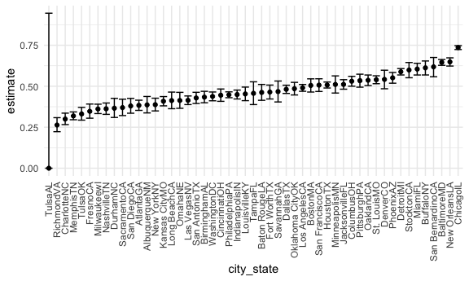
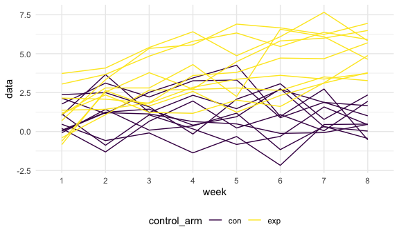

p8105\_hw5\_yz4186
================
Yunxi Zhang
11/20/2021

``` r
library (readr)
library(tidyverse)
```

    ## ── Attaching packages ─────────────────────────────────────── tidyverse 1.3.1 ──

    ## ✓ ggplot2 3.3.5     ✓ dplyr   1.0.7
    ## ✓ tibble  3.1.4     ✓ stringr 1.4.0
    ## ✓ tidyr   1.1.3     ✓ forcats 0.5.1
    ## ✓ purrr   0.3.4

    ## ── Conflicts ────────────────────────────────────────── tidyverse_conflicts() ──
    ## x dplyr::filter() masks stats::filter()
    ## x dplyr::lag()    masks stats::lag()

``` r
knitr::opts_chunk$set(
  fig.width = 6,
  fig.asp = .6,
  out.width = "90%"
)

theme_set(theme_minimal() + theme(legend.position = "bottom"))

options(
  ggplot2.continuous.colour = "viridis",
  ggplot2.continuous.fill = "viridis"
)

scale_colour_discrete = scale_colour_viridis_d
scale_fill_discrete = scale_fill_viridis_d
```

## Problem 1

``` r
urlfile = "https://raw.githubusercontent.com/washingtonpost/data-homicides/master/homicide-data.csv"
```

#### a) Describe the raw data. Create a city\_state variable (e.g. “Baltimore, MD”) and then summarize within cities to obtain the total number of homicides and the number of unsolved homicides (those for which the disposition is “Closed without arrest” or “Open/No arrest”).

``` r
homicide_df = read_csv(url(urlfile), na = c("", "Unknown")) %>%  
  ## mutate "city_state and disposition
  mutate(city_state = str_c(city, state),
         resolution = case_when(
           disposition == "Closed without arrest" ~ "unsolved",
           disposition == "Open/No arrest"        ~ "unsolved",
           disposition == "Closed by arrest"      ~ "solved"
        )) %>% 
  relocate(city_state) %>% 
  filter(city_state != "TulsalAL") 
```

    ## Rows: 52179 Columns: 12

    ## ── Column specification ────────────────────────────────────────────────────────
    ## Delimiter: ","
    ## chr (8): uid, victim_last, victim_first, victim_race, victim_sex, city, stat...
    ## dbl (4): reported_date, victim_age, lat, lon

    ## 
    ## ℹ Use `spec()` to retrieve the full column specification for this data.
    ## ℹ Specify the column types or set `show_col_types = FALSE` to quiet this message.

``` r
homicide_df %>%  count(city_state) 
```

    ## # A tibble: 51 × 2
    ##    city_state        n
    ##    <chr>         <int>
    ##  1 AlbuquerqueNM   378
    ##  2 AtlantaGA       973
    ##  3 BaltimoreMD    2827
    ##  4 Baton RougeLA   424
    ##  5 BirminghamAL    800
    ##  6 BostonMA        614
    ##  7 BuffaloNY       521
    ##  8 CharlotteNC     687
    ##  9 ChicagoIL      5535
    ## 10 CincinnatiOH    694
    ## # … with 41 more rows

#### b) For the city of Baltimore, MD, use the prop.test function to estimate the proportion of homicides that are unsolved; save the output of prop.test as an R object, apply the broom::tidy to this object and pull the estimated proportion and confidence intervals from the resulting tidy dataframe.

Let’s focus on Baltimore, MD.

``` r
## for the city of Baltimore, MD
homicount_df =
  homicide_df %>% 
  group_by(city_state) %>% 
  summarize(
    hom_total = n(),
    hom_unsolved = sum(resolution == "unsolved")
  )
```

#### c) Now run prop.test for each of the cities in your dataset, and extract both the proportion of unsolved homicides and the confidence interval for each. Do this within a “tidy” pipeline, making use of purrr::map, purrr::map2, list columns and unnest as necessary to create a tidy dataframe with estimated proportions and CIs for each city.

iterate across the cities…

``` r
result_df = 
  homicount_df %>% 
   mutate(
     prop_tests = map2(.x = hom_unsolved, .y = hom_total, ~prop.test(x = .x, n =.y)),
     tidy_tests = map(.x = prop_tests, ~broom::tidy(.x))
   ) %>% 
  select(-prop_tests) %>% 
  unnest(tidy_tests) %>% 
  select(city_state, estimate, conf.low, conf.high)
```

    ## Warning in prop.test(x = .x, n = .y): Chi-squared approximation may be incorrect

make a plot!

``` r
result_df %>% 
  mutate(city_state = fct_reorder(city_state, estimate)) %>% 
  ggplot(aes(x = city_state, y = estimate)) +
  geom_point() +
  geom_errorbar(aes(ymin = conf.low, ymax = conf.high)) +
  theme(axis.text.x = element_text(angle = 90, vjust = 0.5, hjust = 1))
```



## Problem 2

#### a) Start with a dataframe containing all file names; the list.files function will help

#### b) Iterate over file names and read in data for each subject using purrr::map and saving the result as a new variable in the dataframe

``` r
## list the files
study_df <-
  tibble(
    file = list.files("data")
  )
## generate the new var 
setwd('data')
study_df <-
  study_df %>%
  mutate(data = purrr::map(pull(., file), read_csv))
```

#### c) Tidy the result; manipulate file names to include control arm and subject ID, make sure weekly observations are “tidy”, and do any other tidying that’s necessary

``` r
study_df = 
  study_df %>%
  unnest() %>% 
## manipulate the file name to "arm control" and "subject id"
  mutate(control_arm = substr(file, 1, 3),
         subject_id = substr(file, 1, 6)) %>% 
## pivot the data
  pivot_longer(week_1: week_8, values_to = "data", names_to = "week", 
  names_prefix = "week_") %>% 
  relocate(control_arm, subject_id) 
```

    ## Warning: `cols` is now required when using unnest().
    ## Please use `cols = c(data)`

#### d) Make a spaghetti plot showing observations on each subject over time, and comment on differences between groups.

``` r
study_df %>%
  ggplot(aes(x = week, y = data)) +
  geom_line(aes(group = subject_id, color = control_arm)) 
```


Comment: The experiment group has an overall higher values than the
control group.

## Problem 3

#### The purpose of this problem is to fill in those missing values.

load the data.

``` r
library(tidyverse)
set.seed(10)
iris_with_missing = iris %>% 
  map_df(~replace(.x, sample(1:150, 20), NA)) %>%
  mutate(Species = as.character(Species))
```

#### a) For numeric variables, you should fill in missing values with the mean of non-missing values

#### b) For character variables, you should fill in missing values with “virginica”

``` r
fill_in = function(vector) {
## for numeric variables, fill in NA with the mean of non-missing values
  if (is.numeric(vector)) {
    vector = replace(vector, is.na(vector), mean(vector, na.rm = TRUE))
  }
## for character variables, fill in NA with "virginica"
  else if (is.character(vector)) {
    vector = replace(vector, is.na(vector), "virginica")
  }
  
  else {
    stop("Input must be either numeric or character")
  }
  
  return(vector)
  
}
```

apply the function

``` r
iris_with_missing = 
  iris_with_missing %>% 
  map_df(~ fill_in(.))
```

\`\`\`
